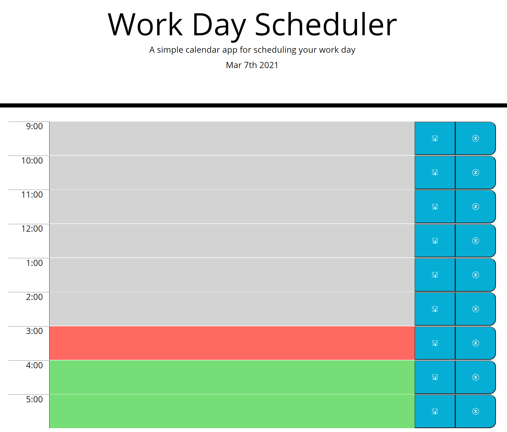
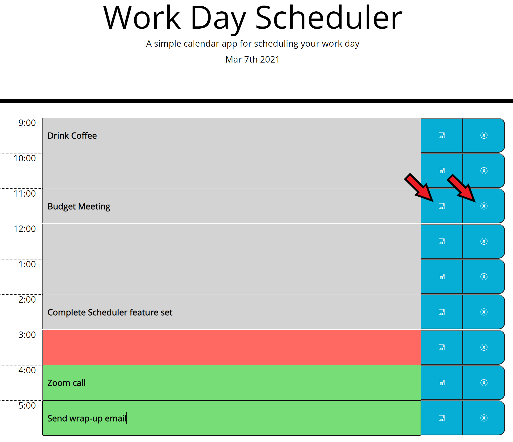

# Workday Planner

## About:

This web-app provides the user with a daily workday planner. When the user first arrives to the page, they will be presented with a serives of time blocks representing the hours of the work day. The time blocks are colored depending on their relation to the current time: grey for past, red for current, green for upcoming. In the text box for each time block, the user can enter text representing to-do items. They can then use the buttons to the right of the time block to either save or clear that entry. When the user reloads the page, all saved events are loaded from local storage.

## How-to:

Load the app at the following URL:

https://crichards17.github.io/Workday-Planner/

## Screenshots:
A user is presented with the labeled time blocks when first visiting the page:

----------
A user can enter text into any of the time blocks, and can then save or clear events using the buttons on the right, indicated by the red arrows:

----------